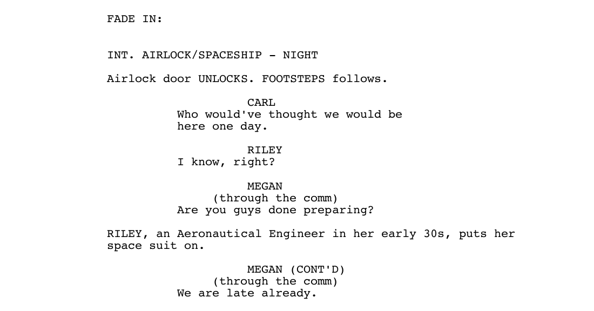

# ScreenPDF

ScreenPDF is a library for easy screenplay generation under Python,
using PyFPDF as base (see [PyFPDF][1] \[[1](#references)]).
ScreenPDF uses [Moreno's how to write a screenplay][2] \[[2](#references)] as reference
for proper screenplay format.

**Contents**

- [How to use](#how-to-use)
    - [Installing ScreenPDF](#installing-screenpdf)
    - [Running ScreenPDF](#running-screenpdf)
- [ScreenPDF Syntax](#screenpdf-syntax)
    - [Informations](#informations)
    - [Begin](#begin)
    - [Content](#content)
- [References](#references)

## How to use

### Installing ScreenPDF

    $ git clone https://github.com/arthurazs/ScreenPDF.git
    $ cd ScreenPDF
    $ pip install -e .

### Running ScreenPDF

    $ screenpdf -h
    $ screenpdf example.spdf
    $ evince Screenplay\ Example.pdf

The [example.spdf](example.spdf) is a 3 page (1 title page + 2 content
pages) example screenplay and will generate the following
[Screenplay Example.pdf](Screenplay%20Example.pdf):

## ScreenPDF Syntax

Here you'll learn how to write your script following the syntax bellow:

    \chars [Riley][Carl][Megan]
    \authors [Arthur Zopellaro][Someone Else]
    \infos [+55 24 999960000][arthurazsoares@gmail.com]
    \title [Screenplay Example]

    \begin

    \int airlock/spaceship - night
    \action Airlock door UNLOCKS. FOOTSTEPS follows.

    \dia {0} I know, right?
    \dia {2} (through the comm) Are you guys done preparing?
    \action {0}, an Aeronautical Engineer in her early 30s, puts her space suit on.
    \dia {2} [CONT'D] (through the comm) We are late already.

    \ext outer space - night
    \action {0}'s face is lit up by the helmet's interior lights.

### Informations

The first few lines are reserved to information such as:

- **chars** (Characters' names)
    - `\chars [Riley][Carl][Megan]`
        - The letter case will be respected for every occurrence
        - Except the first time each name appears (in which will be
        printed all uppercase)
- **authors** (Authors' names)
    - `\authors [Arthur Zopellaro][Jane Doe]`
        - Each author should be inside different brackets
- **infos** (Additional Information)
    - `\infos [+55 24 987654321][arthurazsoares@gmail.com]`
        - Phone number
        - Email
        - Address
- **title** (Screenplay Title)
    - `\title [Screenplay Example]`
        - Printed all uppercase on the first page of the document
        - Also used as the filename (respecting each letter case) to
        output the PDF

### Begin

Between the informations and the screenplay content, you need to declare
a **begin**, e.g.:

- `\begin`

### Content

This is where you write your screenplay. There are various elements such
as:

- **Scene Heading**
    - **int** or interior
    - **ext** or exterior
    - Followed by the scene heading description, e.g.
        - `\int car - day`
        - `\exterior car - night`
- **Action**
    - **act** or action
    - Followed by the action description, e.g.
        - `\action They walk slowly towards the car.`
    - You can also use characters in your actions with `{number}`, e.g.
        - `\act {1}, an odd looking man, walks slowly towards the car.`
        - Each respective `{number}` will be printed as the name
        declared on the information character section
        - The very first name's ID is 0, the second name's ID is 1, e.g.
            - `\chars [Riley][Carl][Megan]`
            - Riley is {0}
            - Carl is {1}
        - Each character's first appearence on the text will be printed
        all uppercase, e.g.
            - `CARL, an odd looking man, walks slowly towards the car.`
- **Dialogue**
    - **dia** or dialogue
    - Followed by a character's ID
        - e.g. `{0}`
    - Followed by extension (OPTIONAL)
        - e.g. `[CONT'D]`
    - Followed by parenthetical (OPTIONAL)
        - e.g. `(whispering)`
    - Followed by the speech line, e.g.
        - `\dia {2} [CONT'D] (whispering) Got it?`
        - `\dialogue {1} Got it.`

## References

\[1] Reingart, M. (2013). pyfpdf: FPDF for Python [online] Available at:
<https://github.com/reingart/pyfpdf> [Accessed 25 Sep. 2016].

\[2] Moreno, M.; Tuxford, K. (2010). How to Write a
Screenplay: Script Writing Example & Screenwriting Tips [online]
Available at:
<https://www.writersstore.com/how-to-write-a-screenplay-a-guide-to-scriptwriting/>
[Accessed 25 Sep. 2016].

[1]: https://github.com/reingart/pyfpdf
[2]: https://www.writersstore.com/how-to-write-a-screenplay-a-guide-to-scriptwriting/
